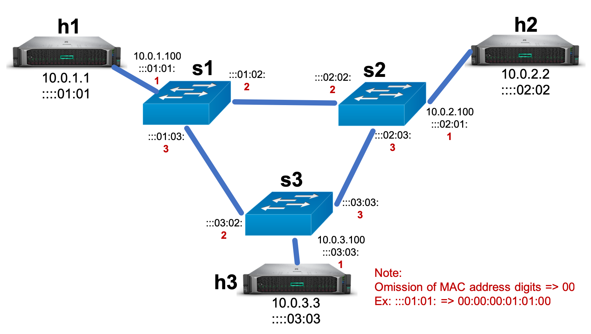

# Project 2: Implementing a Simple Router

Note: you may work in teams of two for this and subsequent projects.

## Introduction

In the last project, you implemented a Layer-2 learning Ethernet switch.
As we move up the networking stack, it is time to learn about the operation of a Layer-3 (L3) router.
The purpose of a router is to connect two or more networks to form an *internetwork*.
This is even true when two routers are directly connected to one another---the link between them will use Ethernet or a similar protocol, and the local area network between the two routers will only have two members.
Note that this means routers can typically understand some set of L2 protocols, at least well enough to parse the frame's header and determine if it is intended for the router itself.


There are several differences between Layer-2 and Layer-3, but a primary one is that we no longer have 'flat' addresses.
Instead, addresses are designed to give some indication as to where in the network the destination resides, and routers need cooperate to be able to efficiently route packets to those destinations rather than just forward them.
In the next project (project 3), we will look at some of the algorithms that are involved in creating efficient routes, but for now, let's assume that the router is pre-programmed with routes so that we can focus on the actual packet processing.


To that end, by far the most common Layer-3 communications protocol is the Internet Protocol (IP).
Within IP, the most common variant is IPv4, although IPv6 is steadily gaining traction.
At this layer, messages are called *packets* and you can find their format here:

[Wikipedia: IPv4 Packet Structure](https://en.wikipedia.org/wiki/IPv4#Packet_structure)

How does IPv4 interact with the L2 protocols we've learned about so far?  As mentioned in lecture, layering means that hosts and network devices often have a stack of protocols, e.g., Ethernet + IPv4, where packets are successively encapsulated by lower layers before being sent out.
That means that L3 devices (like hosts and routers) will have *both* an IP address and an Ethernet address.
Translating between the two is a protocol called the Address Resolution Protocol (ARP).
ARP is used to translate IP addresses into Ethernet MAC addresses, and ARP packets are formatted as follows:

[Wikipedia: ARP](https://en.wikipedia.org/wiki/Address_Resolution_Protocol)

A great walkthrough of the ARP translation process is given in:

[RFC 1180: A TCP/IP Tutorial](https://tools.ietf.org/html/rfc1180#section-4)


## Provided Code

Download and unzip the `project2` directory into the `projects` directory alongside the directory for project 1 and the `Vagrantfile`.
Then run `vagrant ssh` and `cd /vagrant` to enter the virtual machine just as you did in Project 1.
You may also want to run `make clean` in Project 1 to kill any dangling mininet instances.

This project is also P4-based, but this time, we provide a control plane and you'll implement the data plane.
The provided topology is slightly different than before:



Hosts still have the same IP/MAC addresses, but now routers have them as well!  The IPs of the host-facing ports are `10.0.1.100`, `10.0.2.100`, and `10.0.3.100`.
The other ports also have IP addresses, but you won't need to deal with them in this project.
Just as before, physical port numbers are labeled in red.

Take a look at the provided code in basic.p4 and control_plane.py.
The code currently does not compile, but it includes some helpful scaffolding.
In particular, control_plane.py is complete and you should not need to modify it.
basic.p4 includes L2 functionality, but nothing else.
We've marked the code with TODOs in every code block that differs from the reference implementation---you shouldn't need to modify anything else.


## Implement The Router Data Plane

Your goal is to be able to `ping` any host from any other host:

```console
# e.g., in mininet
h1 ping 10.0.2.2 # h2
```

Pings are a common tool for testing networks, and they basically involve sending a packet from h1->h2, then having h2 automatically send a reply h2->h1.
Both paths must work to receive a response.
This is similar to the functionality of arping, but it operates at L3, rather than L2.

You may have seen in the previous project that the P4 Specification includes a sample implementation of a very simple switch that understands IPv4:

[P4 Specification](https://p4.org/p4-spec/docs/P4-16-v1.0.0-spec.html#sec-vss-all)

Read through that code and understand exactly what it is doing and why.
This example is a good starting point, but there are a few differences in our implementation:

  1. You should update the TTL, but your implementation does not need to check the value.
  2. The checksum computation is different as we are using a different switch model.  We've included instructions in basic.p4 that details what the switch model expects.
  3. Some of the table structures are different.  For instance, we've merged the forwarding with the setting of MAC addresses.
  4. Their implementation does not include ARP or L2 functionality, which are required for end-to-end pings.

A correct implementation will do the following.
Note that control_plane.py provides some hints as to the keys and fields that we expect out of your data plane implementation.

### Ethernet
  The router should be able to parse and generate correct Ethernet headers.

  - Upon receipt of a frame, if the Ethernet destination is not broadcast or the local MAC, the switch should drop it, otherwise, it should pass it to the higher layer functionality. (We implemented this for you)
  - When sending a frame, it should set the source and destination MAC addresses correctly for each hop.

### IPv4
  The router should also be able to parse and route IPv4 headers.

  - Upon receipt of a frame, it should look up the egress port, the egress port's MAC address, and the MAC address of the other end of the link in a routing table.
  The routing table and all of these pieces of information are manually configured through control_plane.py.

### ARP
  ARP is the process by which the hosts can learn the correct MAC addresses for a given IP.
  The router should be able to read ARP requests and send back ARP responses for it's own IP.
  Note that the router does not need to be able to issue ARP requests (its ARP table is manually configured), it just needs to be able to respond.
  The command `hX arp -n` may be useful to see which ARP entries have been successfully added on host hX.


## Answer questions

Just like last time, answer the questions in `questions.txt`.

## Submission and Grading

Submit your basic.p4 and questions.txt to Canvas.  Make sure to **Indicate both partner's names and Penn IDs in a comment at the top of both files.**

As always, start early and feel free to ask questions on Piazza and in office hours.


